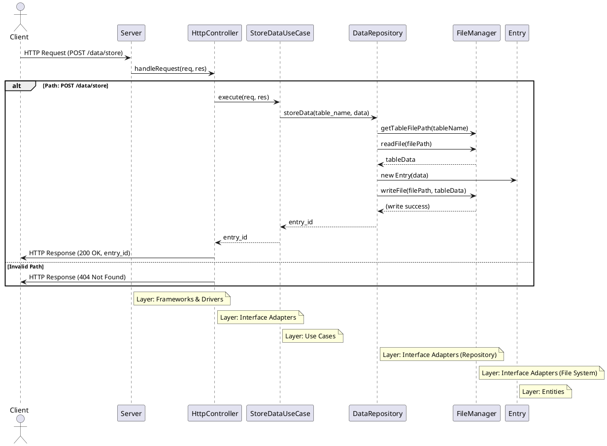

# UniBase

UniBase is a web service for storing and retrieving data. It supports various data manipulation operations including data storage, retrieval, update, deletion, and table management.

## Architecture Overview

UniBase is built following the principles of Clean Architecture, which promotes separation of concerns and independent layers. This design ensures the system is scalable, maintainable, and testable.

### Layers

1. **Frameworks & Drivers**: Handles the HTTP server setup and request routing. The server receives requests and delegates them to the controllers for further processing.
   
2. **Interface Adapters**: Contains the controllers and repositories. The controllers adapt the HTTP requests into method calls for the use cases, while the repositories handle interactions with the data layer (in this case, the file system).

3. **Use Cases**: Implements the application's business logic. Each use case corresponds to a specific business operation (e.g., storing data, retrieving data). Use cases interact with repositories to perform necessary data operations.

4. **Entities**: Contains the core business entities, which encapsulate the data structure used within the application.

### Request Flow

When a request is made to UniBase, it passes through the following layers:

1. **HTTP Request**: The client sends an HTTP request to the UniBase server.
   
2. **Server (Frameworks & Drivers Layer)**: The Node.js server receives the request and passes it to the `HttpController`.
   
3. **HttpController (Interface Adapters Layer)**: The controller identifies the type of request and forwards it to the appropriate use case.

4. **Use Cases Layer**: The use case class handles the business logic and coordinates operations, such as storing or retrieving data. It interacts with the `DataRepository` to access and manipulate data.

5. **DataRepository (Interface Adapters Layer)**: The repository manages the interaction with the file system, using the `FileManager` to perform read/write operations.

6. **FileManager (Interface Adapters Layer)**: The file manager performs the actual file I/O operations, reading from or writing to JSON files that represent tables.

7. **HTTP Response**: The result of the use case execution is returned through the `HttpController` back to the client.

## Functional Requirements

### Data Storage and Retrieval

- The service must accept requests containing a table name and JSON data.
- For each table name, a corresponding file must be created to store the data.
- If a new message comes with the same table name, the data must be appended to the existing file.
- The service must return an `entry_id` for the newly added data.

### Data Retrieval

UniBase must support retrieval of data by table name:
- Retrieve all entries.
- Retrieve data by `entry_id`.
- Retrieve data by searching any of the fields.

### Data Manipulation

UniBase must support:
- Updating rows in a table by `entry_id`.
- Deleting rows in a table by `entry_id`.
- Deletion of an entire table by table name.

## Non-Functional Requirements

### Performance

- UniBase should handle multiple requests concurrently.
- UniBase should be optimized for fast data retrieval and manipulation.

### Scalability

- UniBase should be designed to scale horizontally to handle increased load.

### Security

- UniBase should validate incoming data to prevent injection attacks.
- UniBase should ensure that data retrieval, update, and deletion operations are authenticated.

### Reliability

- UniBase should ensure data integrity during storage and retrieval operations.
- UniBase should handle file I/O errors gracefully and provide meaningful error messages.

### Usability

- The API should have clear and consistent endpoints for storing, retrieving, updating, and deleting data.
- The API should provide meaningful responses for success and error cases.

## API Endpoints

### Store Data

- **Endpoint**: `POST /data/store`
- **Request Body**: `{ "table_name": "string", "data": { ...json... } }`
- **Response**: `{ "entry_id": "string" }`

### Retrieve All Data

- **Endpoint**: `GET /data/{table_name}/all`
- **Response**: `{ "data": [ ... ] }`

### Retrieve Data by `entry_id`

- **Endpoint**: `GET /data/{table_name}/entry/{entry_id}`
- **Response**: `{ "data": { ...json... } }`

### Update Data

- **Endpoint**: `PUT /data/{table_name}/update/{entry_id}`
- **Request Body**: `{ "data": { ...json... } }`
- **Response**: `{ "status": "success" }`

### Delete Data by `entry_id`

- **Endpoint**: `DELETE /data/{table_name}/delete/{entry_id}`
- **Response**: `{ "status": "success" }`

### Delete Table

- **Endpoint**: `DELETE /data/{table_name}/delete`
- **Response**: `{ "status": "success" }`

## Data Format

### Table File Structure

- Each table should be stored in a separate file, e.g., `table_name.json`.
- The file should contain an array of JSON objects, each representing a row of data.

### Index Management

- Each row of data should be assigned a unique `entry_id` upon insertion.
- The `entry_id` should be returned in the response to the insertion request.

## Error Handling

### Invalid Table Name

- Return a 400 error if the table name is invalid.

### Invalid JSON Data

- Return a 400 error if the JSON data is malformed.

### Table Not Found

- Return a 404 error if the specified table does not exist.

### `entry_id` Not Found

- Return a 404 error if the specified `entry_id` does not exist in the table.

### Internal Server Errors

- Return a 500 error for any unhandled server errors.

## Logging and Monitoring

### Request Logging

- Log all incoming requests with timestamps and request details.

### Error Logging

- Log all errors with detailed error messages and stack traces.

### Monitoring

- Implement monitoring to track service performance and availability.

## Documentation

### API Documentation

- Provide detailed API documentation with examples for each endpoint.
- Include information on request and response formats, error codes, and usage scenarios.

### Sequence Diagram

Below is a sequence diagram that illustrates the request flow in UniBase:

## Contributing

Thanks for your interest in contributing to this project.
Get started with our [Contributing Guide][contrib].

## Author

- **Augusto Salazar**

[contrib]: https://github.com/proyectosingenieriauninorte/.github/blob/master/CONTRIBUTING.md
